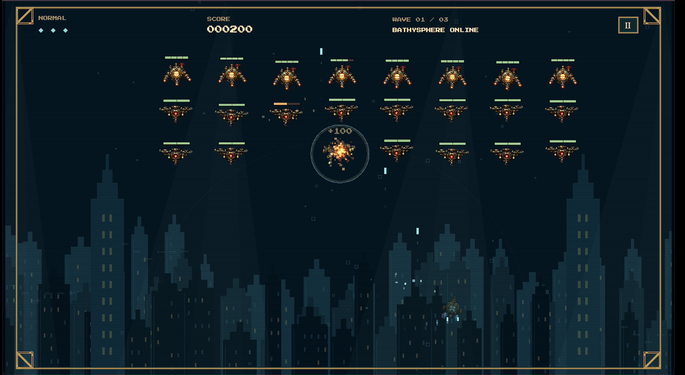

# Rapture Invaders

A playable BioShock-themed fixed-screen shooter built with Phaser 3 and Vite. Hosted scores use a Codex Sites Worker and D1 database.

## Presentation

[](docs/presentation/gameplay.mp4)

- [Watch the gameplay video](docs/presentation/gameplay.mp4)
- [View the gameplay screenshot](docs/presentation/gameplay.png)
- [Codex conversation history](docs/presentation/history/codex-cli-prompt-history.md) · [HTML export](docs/presentation/history/codex-cli-prompt-history.html)
- [ChatGPT conversation history](docs/presentation/history/chatgpt-prompt-history.txt) · [HTML export](docs/presentation/history/chatgpt-prompt-history.html)
- [Play on Codex Sites](https://rapture-invaders.simonvdw.chatgpt.site) — currently private; viewers need access.

The video and screenshot show the game in action. The conversation exports document development and art direction; historical local-file links in those exports may not resolve on GitHub.

## Run

```sh
npm install
npm run build
npm run db:local
npm run dev:hosted
# In another terminal for hot reload:
npm run dev
```

Open the URL printed by Vite (normally http://localhost:5173). `npm run build` produces `dist/client` plus `dist/server/index.js`. The Worker preview runs on http://localhost:8787; Vite proxies `/api` to it. `npm test` checks combat, audio, and leaderboard validation/persistence. Run `npm run db:generate` after schema changes; commit generated migrations. Sites applies them on deployment. Wrangler configuration is local-only; Sites manages the production database binding.

## Play

- Arrow keys or WASD: move within the lower combat area.
- Hold Space: shoot. Escape: pause/resume.
- Three fleets of 24 ships, followed by Big Daddy with three phases at 50–31, 30–16, and 15–1 HP.
- Hits to kill: security flyer 2, rivet drone 4, heavy gunship 5 (2 armor + 3 hull), Big Daddy 75 in Normal and 375 in Drowned (including armor). Every enemy has a health bar; heavy armor sits above hull.
- Every fifth normal enemy drops a pickup, cycling through invincibility, triple shot, and chain burst. Collect by touching it. Each lasts nine seconds; effects can overlap.
- Burst produces eight radial shots only on direct player-shot kills while active. Burst-shot kills never propagate. Fragments last 650 ms (about 215 px of travel); at most 24 may coexist, and a new burst is skipped if fewer than eight slots remain.
- Normal enemies hold fire in formation. Selected ships telegraph a sortie for 500 ms, zigzag down while shooting, then return to formation. At most two sorties coexist in wave one and three thereafter. Three player lives. Losing a life plays the death animation, then respawns a new ship at (640, 626), flashing and invincible for 2.2 seconds. The final life leads to game over.
- Options persist locally. The supplied `assets/sfx/music.mp3` loops at 40% by default, starting and repeating from 00:04 to skip the silent intro. Older synth settings migrate once to 40%; later volume choices persist. Playback is requested on menu load and unlocked by the first click/key if autoplay is blocked. One media element and source graph are reused, same-origin tabs share an exclusive Web Lock, and blur/pause/hide stop playback. HMR disposes old audio graphs. Browser verification must always launch with `--args "--mute-audio"` to avoid playing alongside the user's browser. Sound effects are synthesized. Armor hits use a short metallic ting with three ringing overtones; once armor is gone, hits use the lower hull-impact sound. Credits list Simon as Creator and George Kamar as #1 Fan.
- Basic left/right/fire touch controls are included; desktop is the primary target.

## Project map

| File | Responsibility |
| --- | --- |
| `src/game.js` | Ocean backdrop, combat loop, collisions, waves, boss, effects |
| `src/rules.js` | Enemy tuning, armor damage, fleet layout, burst geometry |
| `src/assets.js` | Actor animation lifecycle and pickup-only chroma-key shader |
| `src/actor-animations.js` | Supplied actor frame sizes, frame rates, fire-frame metadata |
| `src/scores.js` | Hosted scoreboard client and legacy local score helpers |
| `worker/index.js`, `worker/database.js` | Score API, validation, and D1 queries |
| `db/schema.ts`, `drizzle/` | Hosted score schema and migrations |
| `src/juice.js` | Light shafts, fish, sonar, hit flashes, shockwaves, score feedback |
| `src/main.js` | Phaser boot, screen navigation, controls, HUD |
| `src/style.css` | Native menu and settings presentation |
| `src/audio.js` | Saved volumes, supplied music loop, synthesized effects |
| `public/assets/asset-overview.png` | Unmodified copy of the supplied art overview |
| `output/verification/` | Browser captures at 1280 × 720 |

## Big Daddy specials

Big Daddy has 50 HP plus 25 armor in Normal or 325 armor in Drowned, and cycles through three visually telegraphed specials, without attack instructions or phase callout text. He braces in place during attacks and moves during reload windows. Difficulty escalates at 60% and 30% combined armor and health; attacks already in progress keep their original phase tuning.

- **Electro Bolt:** two marked vertical lanes in phase one, three later. Subtle cyan fills and square brass corner brackets show the shock area; there are no arrow patterns or text instructions. Targets lock when the warning begins. After 1.1 / 1.0 / 0.9 seconds the lanes become dangerous for 1.05 seconds. Safe space remains outside the marked lanes.
- **Depth Charges:** two / three / four marked pods fall into the lower arena, then detonate in sequence into 10 / 12 / 14 radial projectiles each. Markers show the destinations before launch.
- **Rivet Barrage:** a visible fan warning precedes a sweeping series of paired or triple shots. Phase three increases firing speed.

Reload windows last 1.35 / 1.15 / 0.95 seconds. The boss remains damageable throughout. Losing a life cancels current hazards and gives an additional recovery window; pause freezes all special timing, and boss death/menu/restart destroy the hazard graphics and state. `src/boss.js` owns the attack director and `src/boss-rules.js` contains phase tuning and hazard geometry.

## Wave transitions and high scores

The four supplied sheets from `output/wave-announcements-v1` play before waves 1–3 and Big Daddy: 32 frames at 14 fps, centered at (640, 304). Combat and power-up clocks hold during announcements, and Escape pauses the counter as well. Enemy entry begins after the announcement finishes.

The final death plays an animated signal-loss sequence before opening the high-score screen. Victory uses a matching success sequence. Players submit a name and score to the hosted database with SAVE SCORE. Normal and Drowned have separate top-five tables; the menu HIGH SCORES button can browse both. Retries preserve a run ID and secret edit token to prevent duplicate rows or renaming another run. Load and save failures are explicit, with a retry button. Existing device-only records are preserved but are not automatically uploaded.

The server validates mode, wave, score range, score increments, and names; it does not simulate gameplay and is not a competitive anti-cheat system. Site access remains owner-private until sharing is explicitly changed.

## Drowned

Start Game opens difficulty selection. Drowned has two hulls, 18% faster enemy shots, 25% shorter dive intervals and 45% shorter boss recovery, one additional simultaneous diver, 15% shorter enemy fire intervals, and seven-second power-ups. Drowned boss volleys fire 25% more frequently by interval, with an additional 20% projectile speed. Music smoothly shifts to 95% speed with lowered pitch and restores to 100% at the menu, without replacing the audio element. Retry keeps the mode. Art currently uses a cold tint; register delivered replacement animation sheets in `src/drowned-assets.js` under `public/assets/drowned/`.


## Art and effects

Transparent animation strips from `output/sprites-v1` are copied to `public/assets/sprites-v1`. Player and normal enemy frames are 96 × 96; boss frames are 256 × 256. They render at native scale because the canvases already include padding around the intended hull sizes. Hitboxes remain based on hull dimensions, not the transparent frame canvas.

All sixteen animations are loaded. Idle loops; attack/shoot/consume return to idle; deaths remove actors only after animation completion. Projectiles spawn at the authored fire-frame indices. Simulation, sprite animations, effects, and result delays pause together.

Only the three pickup icons still use concept-sheet crops and the temporary navy chroma-key shader. New versions of actor strips can replace the same files; update `src/actor-animations.js` if frame layout or timing changes.

Combat feedback includes banking, thruster wakes, bullet trails, hit flashes, armor-break cues, layered explosion rings, death strips, floating scores, camera shake, and brief kill impact pauses. The city has parallax, drifting shafts of light, fish, bubbles, and sonar sweeps. Reduced-motion preference disables impact camera shake/flash.

The supplied pixel-art cutout is an unmodified asset at `public/assets/menu-cameo-pixel-v2.png`. Exactly one decorative image appears on the main menu only. At 24% of the screen width, a 14-second CSS animation fades between 0 and 13% opacity while floating and rotating; each pass moves it to another position. The cutout retains its pixel edges. Reduced-motion preference uses a static 13% opacity image.

## Visual status

The supplied main-menu/options/credits images guide the brass, navy, cream, pixel-text presentation and native control layout. This is a foundation, not a claim of pixel parity: the skyline is procedural, corners are simplified, and Press Start 2P is a provisional font because no original font file was supplied. The actor animation sheets and music loop are integrated. Final skyline art, authored sound effects and human balance playtesting remain future work.

Phaser installation reference: https://docs.phaser.io/phaser/getting-started/installation
