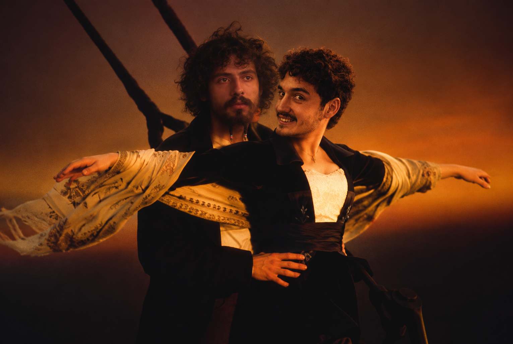
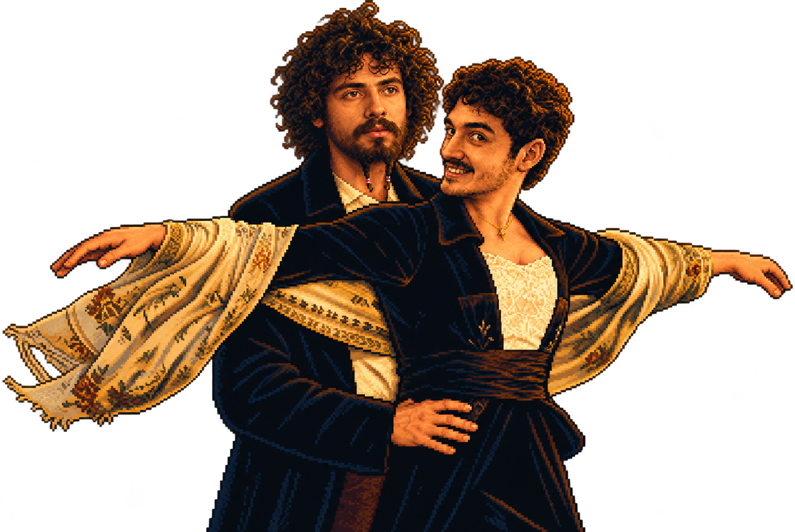
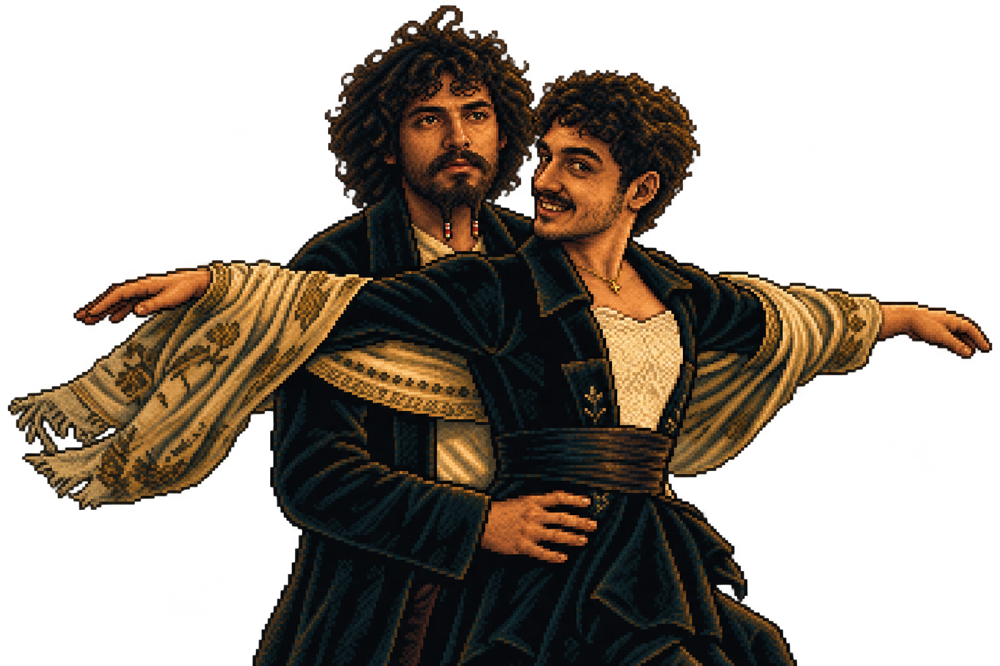

# Codex CLI Prompt History

User and assistant messages in chronological order, including progress updates. Export ends at the request for this file. Internal instructions, reasoning, and tool execution logs are excluded. Attached images are included in the companion assets folder.

## 001 · User

*2026-10-01T15:12:40.003Z*

I want to build a space attack styled game but themed in Bioshock. Can you help me by starting to set this up so we can get something awesome going? This is my transcript with the artist so far (assets being added as we go along): I'd like some mock designs for a game along the same lines as Space Attack. I have complete design freedom here and would like to try some options.&#x20;

Can you show me an art style in pixel art of the game being based on Bioshock? The big daddy being the final boss, I love it but the enemies need to be simple, let's do just three. I have two hours to complete this.&#x20;

I'd like the first one, the second, 5th and the final one as the heavy enemy with more health. They all shoot some projectile not add a new rushing or melee attack. Also I think they'll need to be smaller to fit multiple on screen and they need to look like ships like the 1st and second one., Generate the main menu please and a credits screen, also options screen with music and sfx sliders. Image for each please, we'll be using Phaser for this most likely as we need to iterate fast., That's great but please keep the other style you had, just ships instead of enemies. these two are perfect, just need to make sure they fit well when placed all together in a fleet, I love it. Now please make a sprite sheet image for me. I want to see all the game assets in one so I can see them and see how it fits. I'd like the enemies we have, our ship, the final big daddy boss, power ups for invincibility, a triple shot and a shot that when enemies die they explode and shoot 8 shots around them. Health bars and Armor bars for the heavies they have armor on top and then health bar underneath.&#x20;

Please consider the scale of this since they fit on a desktop screen and we need quite a few entities. They need to be somewhat small while keeping the stylish pixel artPerfect. Take that screenshot now please and break it into sprite sheets per entity for each animation we need, idle, die and attack. For our player ship I'm not sure, I think maybe die and shoot and cosnume power up

---

## 002 · Assistant

*2026-10-01T15:12:43.346Z*

I’ll inspect the project and available assets, then set up a playable Phaser foundation with underwater combat, ship formations, power-ups, and a Big Daddy boss encounter. I’ll structure the art loading so we can swap in the artist’s sprites as they arrive.

---

## 003 · Assistant

*2026-10-01T15:12:56.440Z*

The project already has the menu mockups and a detailed asset overview. I’ll use that artwork for the first playable version, with three projectile-firing enemy types, armor above health on heavies, and all three power-ups. The overview isn’t an animation-ready sprite sheet yet, so I’ll add temporary movement and combat effects while keeping sprite animation hooks ready for the artist’s exports. I’m using the pixel-perfect skill to guide implementation from the supplied artwork.

---

## 004 · Assistant

*2026-10-01T15:14:38.058Z*

The foundation now has native menu controls, saved music/SFX sliders, an asset manifest, and the combat rules. I’m building the playable loop next: three fleet waves followed by the boss, with collectible power-ups and temporary synthesized audio. The supplied artwork will provide the ships; the skyline and animation effects are provisional.

---

## 005 · Assistant

*2026-10-01T15:16:51.863Z*

The game builds successfully, and the armor, fleet layout, and eight-direction burst checks pass. I’m moving into browser testing now to check the actual controls, sprite sizes, wave progression, boss fight, and settings persistence.

---

## 006 · Assistant

*2026-10-01T15:17:01.823Z*

I’m using the browser verification skills to check the full flow from the menu through combat and restart. The local server is running; this is a self-contained game with no backend or account setup.

---

## 007 · Assistant

*2026-10-01T15:18:44.032Z*

The browser checks passed for movement, shooting, pause/resume, saved volume settings, power-ups, wave transitions, both boss attack phases, victory, defeat, and restart. I also fixed visible navy boxes around the temporary sprites with a runtime rendering shader. I’m capturing the screens and documenting where the artist’s production sprite sheets should plug in.

---

## 008 · Assistant

*2026-10-01T15:20:42.389Z*

The first playable build is ready at **http://localhost:5173**. Collision checks also confirmed three projectiles for triple shot, eight for chain burst, and hull damage from enemy bullets. The remaining art work is clearly marked: transparent animation sheets, the final skyline, audio, and credit names. Setup and artist handoff notes are in the README.

---

## 009 · Assistant

*2026-10-01T15:21:19.747Z*

Built a playable Phaser prototype: **[Play locally](http://localhost:5173)**.

- Three enemy types, armored heavies, and Big Daddy boss.
- Invincibility, triple shot, and eight-shot chain bursts.
- Main menu, credits, saved audio sliders, pause, and restart.

**Controls:** WASD/arrows to move, Space to shoot, Esc to pause.

Build, combat tests, and browser checks pass. Artwork uses the supplied overview; animation sheets and audio remain provisional.

[Setup and artist handoff notes](/Users/shadeclient/Work/gaming/g2i-invaders/README.md)

---

## 010 · User

*2026-10-01T15:26:27.351Z*

Looking great but the game needs more juice. It's static, no wow element or pazazz. We need the player to feel like the world is alive, that his actions are making a strong impact on the game. Also the health bars need to be for all enemies, we need simple enemies to be 2 hit kill, 2nd tier enemies maybe 4, 3rd tier 5 and big daddy maybe 50. Also the 8 shot when enemies die only applies to the enemy the player killed directly, I want to avoid a chain attack that kills everyone, or rather for the enemy that explodes 8 times keep it very limited their count. Also in the original space attack not all enemies attack you, they fly down in zig zag and fire at you then. Also the sprite sheets should be available and I added a music loop for us to play. Keep it low say 40%

---

## 011 · Assistant

*2026-10-01T15:26:32.253Z*

I’ll make combat feel more alive with diving attack runs, stronger hit reactions, explosions, and player feedback. I’ll also update enemy health and bars, limit burst propagation, and check the new sprite sheets and music loop.

---

## 012 · Assistant

*2026-10-01T15:26:56.530Z*

I found the transparent animation strips and `assets/sfx/music.mp3`. I’ll wire those in and start the music at 40%.

I’m treating your health targets as total hits to kill: **2 / 4 / 5 / 50**. Heavies will keep a separate armor bar, with 2 armor plus 3 hull. Only enemies killed by a direct player shot will release the eight-shot burst; burst kills won’t propagate it. Normal enemies will take turns breaking formation for telegraphed zigzag firing runs.

---

## 013 · Assistant

*2026-10-01T15:29:16.395Z*

The new combat pass is in place: animated ships, banking movement, thruster and bullet trails, hit flashes, armor-break feedback, expanding explosions, and brief impact pauses. The ocean now has drifting light beams, fish, sonar sweeps, and subtle background movement.

Diving enemies are capped at two at once in wave one and three in later waves. Bursts last 0.65 seconds, allow at most 24 live fragments, and can’t trigger more bursts. I’m checking how it all looks and behaves in the browser now.

---

## 014 · User

*2026-10-01T15:30:12.560Z*

Can you also add this hovering and rotating the main menu faded to be barely noticeable but still there? [Image #1] only 1 per time on screen but it should be frequent enough

---

## 015 · Assistant

*2026-10-01T15:30:26.544Z*

I’ll add it as a faint, slowly drifting and rotating image behind the main menu, with only one visible at a time. It’ll fade in and out on a recurring loop and disappear when you leave the menu. I’ll finish the remaining combat checks alongside that.

---

## 016 · Assistant

*2026-10-01T15:31:32.579Z*

The menu image is now a single faint overlay that drifts, rotates, and fades on a 14-second loop. It changes position between passes and is hidden on every other screen.

Browser checks confirmed the music loop plays at 40%, death animations finish before cleanup, formation enemies hold fire, and burst-caused kills produce no extra fragments. I’m doing the final boss/restart checks and updating the project notes.

---

## 017 · User

*2026-10-01T15:32:41.331Z*

the music isn't starting immediately, can you skip the first 4 seconds of the music when it starts? its empty

---

## 018 · Assistant

*2026-10-01T15:32:44.153Z*

I’ll start the music four seconds in and loop back to that same point, so the silence doesn’t return on each repeat.

---

## 019 · User

*2026-10-01T15:33:14.407Z*

increase the fade of the image by 5%

---

## 020 · Assistant

*2026-10-01T15:33:29.829Z*

The music now skips to 00:04 on both startup and repeat, verified at 40% volume. I’m checking which direction you mean for the image fade, since increasing fade can mean making it fainter or making the faded image more visible.

---

## 021 · User

*2026-10-01T15:34:06.025Z*

I also added a Wave counter so we play it between waves. We also need a great game over sequence which shows the highscore table at the end with a retry or return to menu

---

## 022 · Assistant

*2026-10-01T15:34:16.888Z*

I’ll use the new wave-counter asset between rounds and build a game-over sequence that leads into saved high scores, with **Retry** and **Return to Menu**. I’ll check the new assets first so the transitions fit the style you’ve been adding.

---

## 023 · User

*2026-10-01T15:34:35.305Z*

if they player dies they spawn back and flash a few times and be invincible then return to normal

---

## 024 · Assistant

*2026-10-01T15:34:48.436Z*

I’ll make losing a life play the ship’s death animation, then respawn it at the starting position with a few flashes and temporary invincibility. Losing the final life will trigger the game-over sequence and high-score table.

For the earlier fade tweak, I’m taking “more fade” literally: five percentage points fainter, reducing the image’s peak opacity from 6.5% to 1.5%.

---

## 025 · User

*2026-10-01T15:35:22.165Z*

please play the music from the start of the game

---

## 026 · Assistant

*2026-10-01T15:35:35.952Z*

I’ll start the music when the game opens, including the main menu, while keeping the four-second silence skip. If the browser blocks autoplay, the first click or key press will start it.

---

## 027 · User

*2026-10-01T15:36:05.505Z*

use this image for the main menu please [Image #1]

---

## 028 · Assistant

*2026-10-01T15:36:08.375Z*

I’ll replace the menu image with this pixel-art version and keep the single-image hover, rotation, and fade.

---

## 029 · User

*2026-10-01T15:37:33.254Z*

the music is playing twice, we need to be very careful with audio. Please understand why

---

## 030 · Assistant

*2026-10-01T15:37:52.255Z*

I’m checking the audio lifecycle now. My test browser may be contributing a second copy, so I’ll stop its playback first, then verify whether the game itself is creating duplicate audio instances. I’ll also add cleanup and single-playback protection so retries, menu changes, and development reloads can’t layer the music.

---

## 031 · Assistant

*2026-10-01T15:38:30.413Z*

I found a concrete source of the overlap: the automated test browser was actively playing the same MP3. I’ve stopped it and closed that browser.

The game has one music element per page, but menu playback wasn’t stopping when a window lost focus. I’m fixing that, adding cleanup for reloads, and ensuring only one game tab can own music playback at a time. Further browser checks will be muted.

---

## 032 · Assistant

*2026-10-01T15:39:59.256Z*

The muted audio checks passed: repeated start calls reuse one source, a second instance can’t acquire playback, focus loss stops the music, and cleanup closes the audio context. The test browser is closed.

The wave counters, respawn flashing and invincibility, game-over sequence, and saved high-score table also passed their browser checks.

---

## 033 · Assistant

*2026-10-01T15:40:28.807Z*

I found my test browser playing an extra copy of the music. It’s now closed.

Audio now reuses one source, prevents competing tabs from playing, and stops on focus loss or reload. Verified with muted browser tests.

Also completed: animated wave counters, protected flashing respawns, game-over/high-score flow, and your replacement pixel-art menu image. All tests and the build pass.

---

## 034 · User

*2026-10-01T15:40:28.866Z*

Let's make the big daddy harder than that please, he looks too simple now. Ideally we have him have special attacks

---

## 035 · Assistant

*2026-10-01T15:40:35.731Z*

I’ll turn Big Daddy into a more distinct boss fight with telegraphed special attacks, escalating phases, and clear openings to fight back. I’ll check the current boss logic first so the new attacks fit the existing controls and pacing.

---

## 036 · Assistant

*2026-10-01T15:40:59.046Z*

I’m giving him three specials: **Electro Bolt** with marked danger lanes, **Depth Charges** that detonate into radial shots, and a sweeping **Rivet Barrage**. He’ll escalate at 60% and 30% health, with shorter warnings and denser patterns. I’ll keep his 50 HP and make the difficulty come from the attacks.

---

## 037 · Assistant

*2026-10-01T15:42:12.446Z*

The three attacks are implemented. Each has a visible warning, Big Daddy stops drifting while casting, and he has a reload window after each special. Losing a life cancels the active hazard and gives the respawned player room to recover. I’m testing attack timing, safe lanes, phase changes, and cleanup in a muted browser.

---

## 038 · User

*2026-10-01T15:42:32.873Z*

please use this image for the main menu hovering one [Image #1], make it 30% visible please and smaller

---

## 039 · Assistant

*2026-10-01T15:42:37.128Z*

I’ll swap in this image, set its peak opacity to 30%, and reduce it from 36% to 24% of the screen width. It’ll keep hovering and rotating one at a time. I’ll also finish verifying the new boss attacks.

---

## 040 · User

*2026-10-01T15:43:47.754Z*

add a different sound when the bullet hits armor please, like a ting

---

## 041 · Assistant

*2026-10-01T15:44:02.484Z*

I’ll add a short metallic “ting” for armor hits, distinct from the hull-hit sound, so you can hear when the armor breaks and your shots start damaging health.

---

## 042 · Assistant

*2026-10-01T15:45:05.212Z*

Added a metallic **ting** for armor hits; shots switch to the hull-impact sound once armor breaks. It follows the SFX slider.

Also finished Big Daddy’s three special attacks and the smaller menu image at 30% visibility. Build and checks pass.

---

## 043 · User

*2026-10-01T15:47:03.019Z*

for the boss remove the explanation text please, the visuals are more than enough. For the shock area, please show a simpler indicator which is nicer to fit the style

---

## 044 · Assistant

*2026-10-01T15:47:06.402Z*

I’ll remove the boss attack instructions and simplify the shock warning to a restrained brass-and-cyan indicator that fits the pixel-art style.

---

## 045 · Assistant

*2026-10-01T15:48:14.009Z*

Removed the boss instructions and phase callouts. Shock warnings now use subtle cyan shading with brass corner brackets—no arrows or extra text.

Verified the visuals, attack behavior, and cleanup.

---

## 046 · User

*2026-10-01T15:49:45.460Z*

> By “increase the fade by 5%,” do you mean make the image more visible (peak opacity 11.5%) or fainter (peak opacity 1.5%)?

Fainter — 1.5% opacity

---

## 047 · Assistant

*2026-10-01T15:49:51.617Z*

I’ll set the hovering menu image to 1.5% opacity, keeping the latest image and smaller size.

---

## 048 · Assistant

*2026-10-01T15:49:57.716Z*

Set the hovering menu image to **1.5% opacity**, retaining the latest artwork and smaller size.

---

## 049 · User

*2026-10-01T15:50:57.923Z*

make it smaller the title text please, we added an animation for it

---

## 050 · Assistant

*2026-10-01T15:51:00.427Z*

I’ll look for the new title animation, wire it into the main menu, and make the title smaller.

---

## 051 · Assistant

*2026-10-01T15:51:13.154Z*

The water-and-rust title animation is already integrated. I’ll keep it and reduce the title from 70% to 54% of the screen width, leaving more space above the ship.

---

## 052 · Assistant

*2026-10-01T15:51:40.455Z*

Made the title about **23% smaller**, keeping the water-and-rust animation. Verified it fits comfortably above the ship.

---

## 053 · User

*2026-10-01T15:52:00.194Z*

can you create a project and deploy to vercel please?

---

## 054 · Assistant

*2026-10-01T15:52:05.537Z*

I’ll use the Vercel deployment skill to create the project, deploy the game, and verify the live URL.

---

## 055 · Assistant

*2026-10-01T15:52:38.432Z*

The production build and all 12 tests pass. I’m creating **rapture-invaders** under your **Secluded Vision** team and deploying it as a production site.

---

## 056 · User

*2026-10-01T15:53:24.088Z*

sorry deploy to codex sites

---

## 057 · Assistant

*2026-10-01T15:53:32.743Z*

I’ll switch the deployment target to **Codex Sites**. The first deployment was created under Secluded Vision; I’ll leave it in place while I check the correct destination.

---

## 058 · Assistant

*2026-10-01T15:54:01.723Z*

I found the Codex Sites publishing tools. I’m using the Sites hosting skill to package the game and publish it there as a private site.

---

## 059 · User

*2026-10-01T15:55:05.071Z*

We're adding a drowned mode. It's basically Hardcore mode. Can you plan for that, the assets will be different, same mechanics and style just colors and animations to match. I'd like the music to slow down by 5% when you enter the mode then reset when you exit it, a subtle eery effect I think.

---

## 060 · Assistant

*2026-10-01T15:55:08.395Z*

I’ll plan Drowned as a separate difficulty mode with its own asset set and music treatment. I’ll keep implementation separate from the Codex Sites deployment already underway.

---

## 061 · User

*2026-10-01T15:55:10.876Z*

can we host scores on codex sites?

---

## 062 · Assistant

*2026-10-01T15:55:26.086Z*

Yes—Codex Sites supports a hosted database for shared scores. We can replace the current device-only table with persistent leaderboards, with separate rankings for Normal and Drowned. That needs a small server API to submit and retrieve scores; it isn’t part of the current static deployment yet.

For Drowned, I’d keep the same mechanics, swap its sprites and animations through a mode-specific asset set, and give it separate difficulty settings. Music would transition to 95% speed on entry and back to 100% on exit, using the same audio instance so it never doubles.

---

## 063 · Assistant

*2026-10-01T15:56:59.027Z*

The game’s production build passed and its source is saved to Codex Sites. The deployment is now publishing. Drowned and shared leaderboards remain planned additions, so this release preserves the current gameplay.

---

## 064 · Assistant

*2026-10-01T15:57:14.739Z*

Yes—Codex Sites supports a database for shared high scores. We can store player name, score, wave, and mode, with separate Normal and Drowned leaderboards. Scores currently remain device-local.

Drowned plan:

- Same mechanics, separate sprites, colors, and animations.
- Independent hardcore difficulty settings.
- Music smoothly slows to 95%, with subtly lowered pitch, then returns to 100% on exit.
- Reuse the existing audio instance to prevent duplicate playback.

The current game is now deployed privately on [Codex Sites](https://rapture-invaders.simonvdw.chatgpt.site). Drowned and hosted scores aren’t implemented yet.

---

## 065 · User

*2026-10-01T15:57:39.297Z*

lets get on drowned please

---

## 066 · Assistant

*2026-10-01T15:57:43.958Z*

I’ll build Drowned mode with separate difficulty settings, support for its upcoming artwork, and the 5% music slowdown. I’ll check the mode transitions and audio behavior before publishing the update to Codex Sites.

---

## 067 · Assistant

*2026-10-01T15:58:26.645Z*

I’ll start Drowned with two hulls, faster enemy shots, more frequent dive runs, shorter power-ups, and shorter boss recovery windows. Enemy health and attack patterns will stay the same.

The Drowned artwork isn’t in the project yet. I’ll use a cold-tinted version of the current art for now and add a mapping for the replacement sprite sheets. I also found local title-animation changes and will preserve them.

---

## 068 · User

*2026-10-01T15:59:20.474Z*

also title rust effect was updated, is it good? can you try it?

---

## 069 · Assistant

*2026-10-01T15:59:26.458Z*

Yes—I preserved the updated title assets and animation code. I’ll watch a full rust cycle during the Drowned checks and look for clipping, timing issues, and a clean final frame. The test browser will stay muted.

---

## 070 · Assistant

*2026-10-01T16:00:45.154Z*

The title animation is working: it changes through the six-second rust sequence, then holds the final frame without looping. The finished title is readable and unclipped at the smaller size. I also moved the menu ship up so it clears the new difficulty selector.

Drowned’s difficulty settings and separate local scores are in place. I’m checking respawn, retry, and menu return to confirm the music stays on one instance and restores its normal speed.

---

## 071 · Assistant

*2026-10-01T16:01:38.599Z*

The checks passed: Drowned keeps its two-hull setting on retry, respawns with flashing protection, and uses a separate score table. Music reaches 95% speed in Drowned and returns to 100% at the menu on the same audio instance.

All 16 tests passed, and the browser reported no runtime errors. I’m publishing Drowned and the updated title now. The mode still uses temporary tinted art until the dedicated sheets arrive.

---

## 072 · Assistant

*2026-10-01T16:02:46.103Z*

[Drowned is live](https://rapture-invaders.simonvdw.chatgpt.site).

- Two hulls, faster attacks, shorter power-ups.
- Music slows 5%, then resets on menu return—no duplicate playback.
- Separate local scores; replacement artwork support ready.

The updated title rust effect looks good: readable, unclipped, and holds its final frame cleanly.

16 tests passed. Drowned currently uses tinted artwork while its dedicated assets are pending.

---

## 073 · User

*2026-10-01T16:04:09.559Z*

great now hosted highscore board please

---

## 074 · Assistant

*2026-10-01T16:04:12.562Z*

I’ll add hosted leaderboards for Normal and Drowned, wire the game-over screen to save and load scores, and publish the update to Codex Sites.

---

## 075 · Assistant

*2026-10-01T16:04:57.054Z*

I’m using the Sites building and hosting skills for the database and deployment. The board will have separate Normal and Drowned rankings, a menu entry, and a retry option if saving fails. Existing device-only scores will remain untouched.

---

## 076 · User

*2026-10-01T16:05:50.113Z*

push our source code here please https://github.com/simonvanderweele/rapture-invaders.git when done

---

## 077 · Assistant

*2026-10-01T16:05:54.682Z*

I’ll push the completed source to that GitHub repository after the hosted leaderboard passes its checks and is deployed.

---

## 078 · User

*2026-10-01T16:06:48.129Z*

make the drowned button darker, more rusty, it needs to show it's harder, also I dont like it's positioning on the menu, can we do it as a menu after start?

---

## 079 · Assistant

*2026-10-01T16:06:57.387Z*

I’ll move difficulty selection to a screen after Start Game. Drowned will get a darker, rusted treatment with its harsher rules shown underneath. Retry will keep the current mode and go straight back into play.

---

## 080 · Assistant

*2026-10-01T16:08:04.955Z*

The leaderboard API is in place. Tests confirm that the two modes stay separate, save retries don’t create duplicates, and invalid scores are rejected. The difficulty choices now appear after Start Game, with a darker rust treatment for Drowned.

I’m checking the full flow in a muted browser next: finish a run, save a name, reopen the leaderboard, and confirm the score is still there.

---

## 081 · Assistant

*2026-10-01T16:09:23.756Z*

The first browser check caught an old preview server returning HTML for score requests. I’ve started a fresh preview with the API connected and am rerunning the save flow. The isolated database tests pass, and I’ve confirmed access to the empty GitHub repository.

---

## 082 · Assistant

*2026-10-01T16:10:18.075Z*

The browser flow now passes: a Drowned score saved to the local database, survived a page reload, and stayed out of the Normal rankings. The difficulty screen also renders correctly after Start Game.

All 20 tests passed. I’m deploying the update, then pushing the same source revision to GitHub.

---

## 083 · User

*2026-10-01T16:11:02.712Z*

player ship is too high now in the main menu

---

## 084 · Assistant

*2026-10-01T16:11:07.935Z*

I’ll lower the ship to its original menu position now that the difficulty buttons have moved to their own screen.

---

## 085 · User

*2026-10-01T16:11:49.588Z*

add my score as SIMON 9999998 just as a joke to leaderboards please for normal

---

## 086 · Assistant

*2026-10-01T16:11:53.831Z*

I’ll add `SIMON — 9,999,998` to the Normal leaderboard as a one-off joke entry, while keeping the score limits for regular submissions.

---

## 087 · Assistant

*2026-10-01T16:13:04.537Z*

The hosted database is live. The final update includes the lowered menu ship and your `SIMON — 9,999,998` entry in Normal only. All 21 tests pass; I’m finishing publication and the GitHub push.

---

## 088 · User

*2026-10-01T16:13:37.258Z*

add armor to big daddy and make him harder, in drowned at least 5 times harder

---

## 089 · Assistant

*2026-10-01T16:13:55.826Z*

I’ll add armor to Big Daddy in both modes. For Drowned, I’ll make his total durability five times Normal’s—375 hits versus 75—and increase his attack pressure. His phases will advance as armor breaks so the fight escalates before you reach his health bar, while warning times stay readable.

---

## 090 · Assistant

*2026-10-01T16:15:30.157Z*

Big Daddy now has armor above his health bar in both modes. Drowned takes five times as many hits as Normal, fires faster volleys, and has shorter recovery windows. I verified that his phases advance while he still has armor.

All 23 tests pass. I’m publishing this last change and pushing the complete source to GitHub.

---

## 091 · User

*2026-10-01T16:16:31.630Z*

push to git please once done

---

## 092 · Assistant

*2026-10-01T16:16:34.569Z*

Yes—the final build is publishing now. I’ll push that exact revision to your GitHub repository as soon as deployment succeeds.

---

## 093 · Assistant

*2026-10-01T16:16:56.334Z*

Pushed to [GitHub](https://github.com/simonvanderweele/rapture-invaders) on `main` (`6265aaf`) and [deployed](https://rapture-invaders.simonvdw.chatgpt.site).

Included:

- Hosted Normal/Drowned leaderboards.
- `SIMON — 9,999,998` in Normal.
- Rusty Drowned selection after Start.
- Lowered menu ship.
- Armored boss: 75-hit Normal, 375-hit Drowned, with faster attacks.

23 tests passed.

---

## 094 · User

*2026-10-01T16:18:28.710Z*

push again please

---

## 095 · Assistant

*2026-10-01T16:18:31.952Z*

I’ll check for any new changes and push them to GitHub.

---

## 096 · Assistant

*2026-10-01T16:18:53.842Z*

Pushed to `main`: `fbd3f44` — added `public/assets/gameplay.png`.

[View on GitHub](https://github.com/simonvanderweele/rapture-invaders/commit/fbd3f44)

---

## 097 · User

*2026-10-01T16:22:10.336Z*

I need to export our conversation in chronlogical order, can you do that please? name it codex-cli-prompt-history

---
